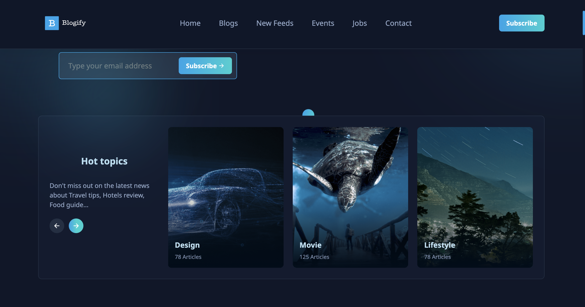
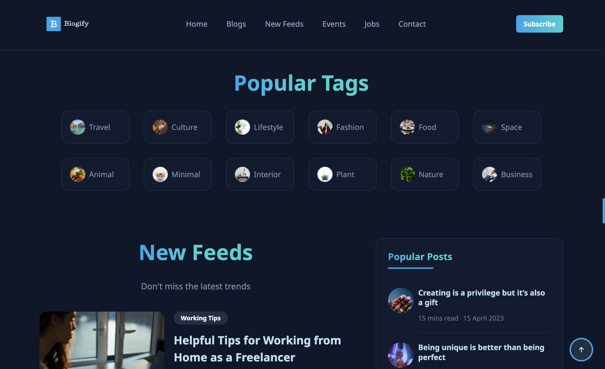
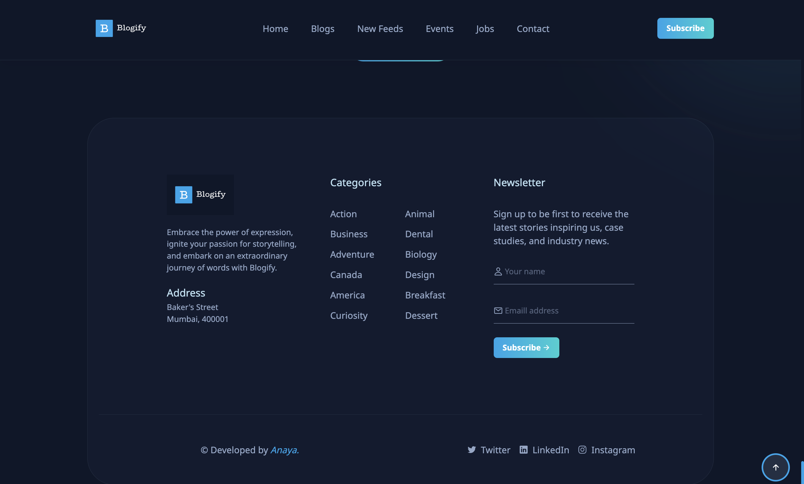

## Blogify

Welcome to the Blogify! This is a simple yet elegant web platform designed for blog content management. It provides a user-friendly interface where visitors can explore a variety of blogs, stay updated with new feeds, view upcoming events, and even browse job opportunities. The website also includes an interactive contact section for user inquiries, creating a seamless experience for both readers and contributors. Whether you're searching for inspiration or looking for the latest updates, this website has you covered.

### App Preview










### Features

- **Home Page**: Introduction and latest blog highlights.
- **Blogs:** Display of all blog posts, with easy navigation.
- **New Feeds:** Updates and latest posts feed.
- **Events:** Section for upcoming events and announcements.
- **Jobs:** Job listings and opportunities.
- **Contact:** Contact form for user inquiries.
  
### Tech Stack

- **HTML:** For creating the structure and layout of the website.
- **CSS:** To style and design the user interface with an attractive and responsive layout.
- **JavaScript:** For adding interactivity and enhancing the functionality of the website.
  
### Getting Started

1. **Clone the Repository:**
   ```bash
   git clone https://github.com/AnayaChoudhari/blog-webiste.git
   ```

2. **Navigate to the Project Directory:**
   ```bash
   cd blog-website
   ```
3. **Access the Application:**
   - Open the index.html file in your browser to view the website.

### Contributing

We welcome contributions to make DiagnosticHub even more feature-rich and accurate. Please fork the repository, make your changes, and submit a pull request.

### License

This project is licensed under the [MIT License](LICENSE).

### Acknowledgements

- Special thanks to the open-source community for the tools and libraries used in this project.
